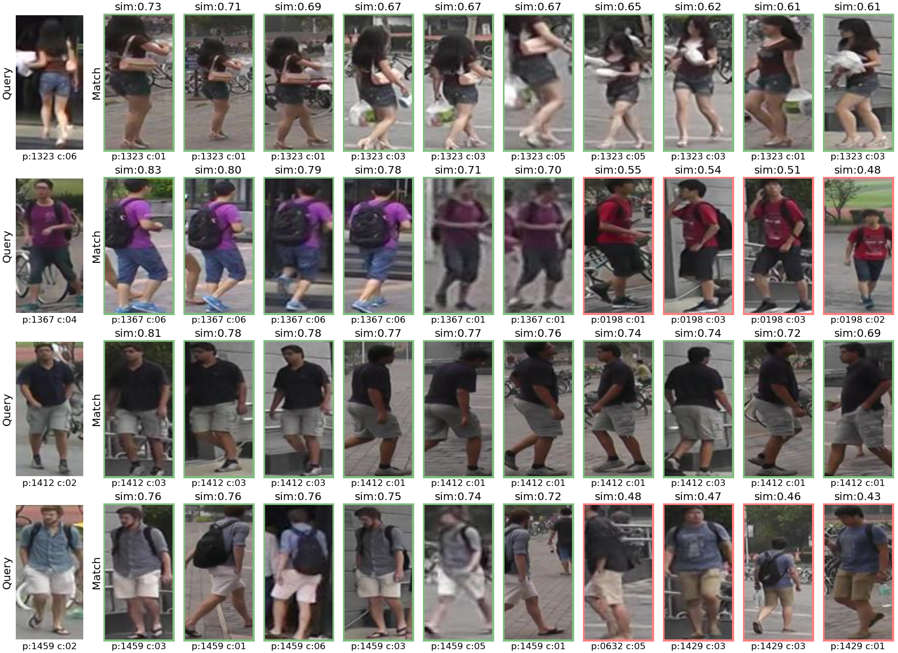
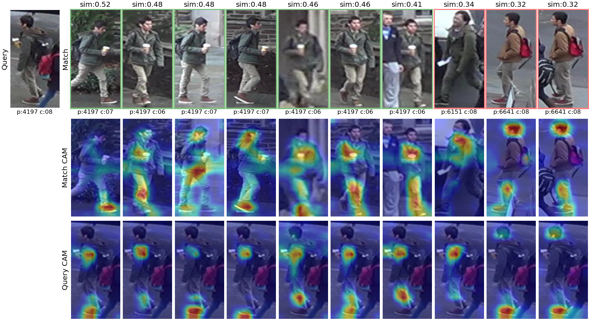

# PyTorch Person Re-identification Models

---

We collected some ReID models from open-source projects and provided a unified interface to access them. We retrained these models on three datasets: [Market1501](https://www.cv-foundation.org/openaccess/content_iccv_2015/papers/Zheng_Scalable_Person_Re-Identification_ICCV_2015_paper.pdf), [DukeMTMCReID](https://arxiv.org/abs/1701.07717), and [MSMT17](https://arxiv.org/abs/1711.08565) using the original open-source code and can automatically load these trained model weights at runtime. For specific usage examples, see [test.py](test.py).

## The main directory structure

```shell
.
├── reid_models
│   ├── data # data load module
│   │   ├── build.py # dataset and dataloader building function
│   │   ├── datasets
│   │   ├── samplers
│   │   └── transforms
│   ├── evaluate # metrics evaluation module
│   │   ├── estimator.py
│   │   ├── eval_function.py # cuda-accelerated reid evaluation function
│   │   └── matcher.py
│   └── modeling # model building module
│       ├── build.py # model building and loading trained weights function
│       ├── models_config.yaml # model configs file
│       └── third_party_models # third-party open source reid models
│           ├── ABDNet
│           ├── AGWNet
│           ├── APNet
│           ├── DeepPersonReid
│           ├── FastReID
│           ├── ReidStrongBaseline
│           └── TransReID
├── tools # some useful tools
│   ├── imagenet_pretrain.py # imagent data pre-training
│   ├── preprocessing_imagenet.py # offline resize image, for faster data loading
│   ├── visualizer_ranklist.py # visualize match results
│   ├── visualizer_ranklist_with_gradcam.py # # visualize match results with gradcam
│   └── visualizer_tsne.py # visualize tsne
├── train.py # reid model training
├── test.py # reid model testing
```

## Highlights

- We rewrite a CUDA-accelerated version of the ReID evaluation code, which has a huge speedup compared to the previous numpy version. For details, see [reid_models/evaluate/eval_function.py](reid_models/evaluate/eval_function.py).
- For each third-party ReID project, we provide a way to dynamically register the model, as seen [reid_models/modeling/third_party_models/FastReID/**init**.py](reid_models/modeling/third_party_models/FastReID/__init__.py). We will expand more models in the future.
- We provide some useful visualization, training and testing tools, as seen in [tools](tools)

## Configuration files

- For path settings with datasets, see [reid_models/data/datasets/dataset_paths.yaml](reid_models/data/datasets/dataset_paths.yaml)
- For model parameters setting, see [reid_models/modeling/models_config.yaml](reid_models/modeling/models_config.yaml)
- For fast-reid models settings, see [reid_models/modeling/third_party_models/FastReID/configs](reid_models/modeling/third_party_models/FastReID/configs)

## Visualization

- Visual matching samples
<center>

</center>

- Visual matching samples with gradcam
<center>

</center>

- Visual TSNE
<center>

</center>

## Model metrics

|   Dataset    |                 Model                  | Top1  | Top5  |  mAP  | mINP  |   MACs   |  Params  |
| :----------: | :------------------------------------: | :---: | :---: | :---: | :---: | :------: | :------: |
| dukemtmcreid |            densenet121_abd             | 0.885 | 0.940 | 0.775 | 0.410 |  5.619G  | 37.569M  |
|  market1501  |            densenet121_abd             | 0.953 | 0.984 | 0.876 | 0.639 |  5.619G  | 37.719M  |
|    msmt17    |            densenet121_abd             | 0.817 | 0.903 | 0.591 | 0.151 |  5.620G  | 38.611M  |
| dukemtmcreid |              resnet50_abd              | 0.878 | 0.941 | 0.773 | 0.398 |  9.377G  | 69.025M  |
|  market1501  |              resnet50_abd              | 0.950 | 0.983 | 0.872 | 0.634 |  9.377G  | 69.175M  |
|    msmt17    |              resnet50_abd              | 0.800 | 0.897 | 0.579 | 0.143 |  9.378G  | 70.067M  |
| dukemtmcreid |              resnet50_agw              | 0.892 | 0.951 | 0.796 | 0.454 |  4.094G  | 23.541M  |
|  market1501  |              resnet50_agw              | 0.955 | 0.983 | 0.883 | 0.653 |  4.094G  | 23.541M  |
|    msmt17    |              resnet50_agw              | 0.789 | 0.885 | 0.554 | 0.128 |  4.094G  | 23.541M  |
| dukemtmcreid |              resnet50_ap               | 0.897 | 0.954 | 0.800 | 0.457 | 16.357G  | 51.281M  |
|  market1501  |              resnet50_ap               | 0.952 | 0.985 | 0.890 | 0.676 | 16.357G  | 51.281M  |
|    msmt17    |              resnet50_ap               | 0.792 | 0.892 | 0.575 | 0.145 | 16.357G  | 51.281M  |
| dukemtmcreid |                mlfn_dpr                | 0.809 | 0.903 | 0.642 | 0.250 |  2.812G  | 32.473M  |
|  market1501  |                mlfn_dpr                | 0.897 | 0.960 | 0.747 | 0.423 |  2.812G  | 32.473M  |
|    msmt17    |                mlfn_dpr                | 0.673 | 0.803 | 0.390 | 0.059 |  2.812G  | 32.473M  |
| dukemtmcreid |             osnet_x1_0_dpr             | 0.878 | 0.938 | 0.764 | 0.403 |  1.013G  |  2.170M  |
|  market1501  |             osnet_x1_0_dpr             | 0.950 | 0.980 | 0.865 | 0.614 |  1.013G  |  2.170M  |
|    msmt17    |             osnet_x1_0_dpr             | 0.784 | 0.882 | 0.547 | 0.128 |  1.013G  |  2.170M  |
| dukemtmcreid |           osnet_ain_x1_0_dpr           | 0.869 | 0.943 | 0.744 | 0.364 |  1.013G  |  2.170M  |
|  market1501  |           osnet_ain_x1_0_dpr           | 0.933 | 0.975 | 0.836 | 0.551 |  1.013G  |  2.170M  |
|    msmt17    |           osnet_ain_x1_0_dpr           | 0.765 | 0.871 | 0.508 | 0.101 |  1.013G  |  2.170M  |
| dukemtmcreid |           osnet_ibn_x1_0_dpr           | 0.869 | 0.941 | 0.743 | 0.361 |  1.017G  |  2.171M  |
|  market1501  |           osnet_ibn_x1_0_dpr           | 0.939 | 0.976 | 0.836 | 0.553 |  1.017G  |  2.171M  |
|    msmt17    |           osnet_ibn_x1_0_dpr           | 0.767 | 0.871 | 0.503 | 0.095 |  1.017G  |  2.171M  |
| dukemtmcreid |              resnet50_bot              | 0.860 | 0.938 | 0.765 | 0.402 |  4.087G  | 23.512M  |
|  market1501  |              resnet50_bot              | 0.941 | 0.982 | 0.857 | 0.593 |  4.087G  | 23.512M  |
|    msmt17    |              resnet50_bot              | 0.739 | 0.854 | 0.503 | 0.106 |  4.087G  | 23.512M  |
| dukemtmcreid |           resnet50_ibn_a_bot           | 0.889 | 0.952 | 0.792 | 0.445 |  4.087G  | 23.512M  |
|  market1501  |           resnet50_ibn_a_bot           | 0.952 | 0.986 | 0.872 | 0.633 |  4.087G  | 23.512M  |
|    msmt17    |           resnet50_ibn_a_bot           | 0.792 | 0.885 | 0.565 | 0.135 |  4.087G  | 23.512M  |
| dukemtmcreid |            se_resnet50_bot             | 0.868 | 0.943 | 0.768 | 0.407 |  3.992G  | 26.043M  |
|  market1501  |            se_resnet50_bot             | 0.944 | 0.982 | 0.864 | 0.607 |  3.992G  | 26.043M  |
|    msmt17    |            se_resnet50_bot             | 0.687 | 0.819 | 0.460 | 0.092 |  3.992G  | 26.043M  |
| dukemtmcreid |            se_resnext50_bot            | 0.884 | 0.950 | 0.786 | 0.433 |  4.104G  | 25.515M  |
|  market1501  |            se_resnext50_bot            | 0.949 | 0.985 | 0.879 | 0.645 |  4.104G  | 25.515M  |
|    msmt17    |            se_resnext50_bot            | 0.768 | 0.869 | 0.546 | 0.129 |  4.104G  | 25.515M  |
| dukemtmcreid |              senet154_bot              | 0.880 | 0.950 | 0.782 | 0.428 | 17.136G  | 113.044M |
|  market1501  |              senet154_bot              | 0.946 | 0.981 | 0.865 | 0.612 | 17.136G  | 113.044M |
|    msmt17    |              senet154_bot              | 0.812 | 0.900 | 0.584 | 0.142 | 17.136G  | 113.044M |
| dukemtmcreid |             deit_transreid             | 0.907 | 0.958 | 0.819 | 0.486 |    -     |    -     |
|  market1501  |             deit_transreid             | 0.950 | 0.983 | 0.885 | 0.672 |    -     |    -     |
|    msmt17    |             deit_transreid             | 0.840 | 0.919 | 0.663 | 0.238 |    -     |    -     |
| dukemtmcreid |           vit_base_transreid           | 0.890 | 0.954 | 0.796 | 0.454 | 11.042G  | 85.648M  |
|  market1501  |           vit_base_transreid           | 0.946 | 0.982 | 0.871 | 0.641 | 11.042G  | 85.648M  |
|    msmt17    |           vit_base_transreid           | 0.817 | 0.906 | 0.618 | 0.204 | 11.042G  | 85.648M  |
| dukemtmcreid |             vit_transreid              | 0.908 | 0.960 | 0.821 | 0.503 |    -     |    -     |
|  market1501  |             vit_transreid              | 0.951 | 0.984 | 0.890 | 0.693 |    -     |    -     |
|    msmt17    |             vit_transreid              | 0.853 | 0.925 | 0.678 | 0.257 |    -     |    -     |
| dukemtmcreid |            agw_R50_fastreid            | 0.891 | 0.948 | 0.791 | 0.445 |  4.057G  | 23.475M  |
|  market1501  |            agw_R50_fastreid            | 0.953 | 0.987 | 0.883 | 0.654 |  4.057G  | 23.475M  |
|    msmt17    |            agw_R50_fastreid            | 0.792 | 0.883 | 0.557 | 0.129 |  4.057G  | 23.475M  |
| dukemtmcreid |          agw_R50_ibn_fastreid          | 0.908 | 0.955 | 0.806 | 0.471 |  4.059G  | 23.478M  |
|  market1501  |          agw_R50_ibn_fastreid          | 0.955 | 0.982 | 0.889 | 0.674 |  4.059G  | 23.478M  |
|    msmt17    |          agw_R50_ibn_fastreid          | 0.818 | 0.903 | 0.595 | 0.155 |  4.059G  | 23.478M  |
| dukemtmcreid |         agw_R101_ibn_fastreid          | 0.908 | 0.953 | 0.810 | 0.476 |  6.488G  | 42.453M  |
|  market1501  |         agw_R101_ibn_fastreid          | 0.953 | 0.985 | 0.891 | 0.682 |  6.488G  | 42.453M  |
|    msmt17    |         agw_R101_ibn_fastreid          | 0.825 | 0.906 | 0.611 | 0.167 |  6.488G  | 42.453M  |
| dukemtmcreid |            agw_S50_fastreid            | 0.907 | 0.957 | 0.811 | 0.475 |  4.665G  | 25.370M  |
|  market1501  |            agw_S50_fastreid            | 0.952 | 0.983 | 0.892 | 0.684 |  4.665G  | 25.370M  |
|    msmt17    |            agw_S50_fastreid            | 0.838 | 0.915 | 0.646 | 0.192 |  4.665G  | 25.370M  |
| dukemtmcreid | bagtricks_mobilenet_v3_large_fastreid  | 0.823 | 0.920 | 0.691 | 0.299 | 179.652M |  4.176M  |
|  market1501  | bagtricks_mobilenet_v3_large_fastreid  | 0.914 | 0.973 | 0.790 | 0.450 | 179.652M |  4.176M  |
|    msmt17    | bagtricks_mobilenet_v3_large_fastreid  | 0.680 | 0.814 | 0.426 | 0.069 | 179.652M |  4.176M  |
| dukemtmcreid |   bagtricks_osnet_ibn_x1_0_fastreid    | 0.876 | 0.943 | 0.750 | 0.384 | 986.660M |  1.885M  |
|  market1501  |   bagtricks_osnet_ibn_x1_0_fastreid    | 0.936 | 0.977 | 0.841 | 0.561 | 986.660M |  1.885M  |
|    msmt17    |   bagtricks_osnet_ibn_x1_0_fastreid    | 0.782 | 0.884 | 0.527 | 0.108 | 986.660M |  1.885M  |
| dukemtmcreid |     bagtricks_osnet_x1_0_fastreid      | 0.879 | 0.945 | 0.769 | 0.405 | 980.369M |  1.884M  |
|  market1501  |     bagtricks_osnet_x1_0_fastreid      | 0.941 | 0.979 | 0.863 | 0.610 | 980.369M |  1.884M  |
|    msmt17    |     bagtricks_osnet_x1_0_fastreid      | 0.802 | 0.896 | 0.570 | 0.138 | 980.369M |  1.884M  |
| dukemtmcreid |         bagtricks_R50_fastreid         | 0.869 | 0.946 | 0.766 | 0.402 |  4.053G  | 23.455M  |
|  market1501  |         bagtricks_R50_fastreid         | 0.945 | 0.982 | 0.861 | 0.600 |  4.053G  | 23.455M  |
|    msmt17    |         bagtricks_R50_fastreid         | 0.752 | 0.862 | 0.516 | 0.111 |  4.053G  | 23.455M  |
| dukemtmcreid |        bagtricks_SeR50_fastreid        | 0.858 | 0.937 | 0.751 | 0.386 |  4.060G  | 25.970M  |
|  market1501  |        bagtricks_SeR50_fastreid        | 0.942 | 0.982 | 0.856 | 0.594 |  4.060G  | 25.970M  |
|    msmt17    |        bagtricks_SeR50_fastreid        | 0.742 | 0.855 | 0.505 | 0.107 |  4.060G  | 25.970M  |
| dukemtmcreid |       bagtricks_R50_ibn_fastreid       | 0.899 | 0.952 | 0.788 | 0.437 |  4.056G  | 23.457M  |
|  market1501  |       bagtricks_R50_ibn_fastreid       | 0.954 | 0.982 | 0.879 | 0.647 |  4.056G  | 23.457M  |
|    msmt17    |       bagtricks_R50_ibn_fastreid       | 0.794 | 0.889 | 0.565 | 0.137 |  4.056G  | 23.457M  |
| dukemtmcreid |      bagtricks_R101_ibn_fastreid       | 0.897 | 0.953 | 0.796 | 0.451 |  6.481G  | 42.401M  |
|  market1501  |      bagtricks_R101_ibn_fastreid       | 0.955 | 0.983 | 0.886 | 0.674 |  6.481G  | 42.401M  |
|    msmt17    |      bagtricks_R101_ibn_fastreid       | 0.815 | 0.900 | 0.593 | 0.153 |  6.481G  | 42.401M  |
| dukemtmcreid |         bagtricks_S50_fastreid         | 0.897 | 0.953 | 0.797 | 0.455 |  4.665G  | 25.370M  |
|  market1501  |         bagtricks_S50_fastreid         | 0.952 | 0.983 | 0.886 | 0.668 |  4.665G  | 25.370M  |
|    msmt17    |         bagtricks_S50_fastreid         | 0.818 | 0.905 | 0.607 | 0.169 |  4.665G  | 25.370M  |
| dukemtmcreid |    bagtricks_convnext_tiny_fastreid    | 0.807 | 0.898 | 0.657 | 0.260 |  4.248G  | 26.630M  |
|  market1501  |    bagtricks_convnext_tiny_fastreid    | 0.906 | 0.967 | 0.768 | 0.431 |  4.248G  | 26.630M  |
|    msmt17    |    bagtricks_convnext_tiny_fastreid    | 0.644 | 0.784 | 0.380 | 0.057 |  4.248G  | 26.630M  |
| dukemtmcreid |     bagtricks_densenet121_fastreid     | 0.853 | 0.935 | 0.727 | 0.335 |  1.850G  |  6.870M  |
|  market1501  |     bagtricks_densenet121_fastreid     | 0.926 | 0.975 | 0.820 | 0.511 |  1.850G  |  6.870M  |
|    msmt17    |     bagtricks_densenet121_fastreid     | 0.729 | 0.850 | 0.473 | 0.084 |  1.850G  |  6.870M  |
| dukemtmcreid | bagtricks_inception_resnet_v2_fastreid | 0.846 | 0.924 | 0.699 | 0.307 |  3.784G  | 54.306M  |
|  market1501  | bagtricks_inception_resnet_v2_fastreid | 0.922 | 0.973 | 0.789 | 0.427 |  3.784G  | 54.306M  |
|    msmt17    | bagtricks_inception_resnet_v2_fastreid | 0.703 | 0.829 | 0.438 | 0.072 |  3.784G  | 54.306M  |
| dukemtmcreid |    bagtricks_inception_v3_fastreid     | 0.829 | 0.914 | 0.677 | 0.284 |  1.681G  | 21.786M  |
|  market1501  |    bagtricks_inception_v3_fastreid     | 0.918 | 0.971 | 0.789 | 0.462 |  1.681G  | 21.786M  |
|    msmt17    |    bagtricks_inception_v3_fastreid     | 0.666 | 0.794 | 0.388 | 0.056 |  1.681G  | 21.786M  |
| dukemtmcreid |    bagtricks_inception_v4_fastreid     | 0.809 | 0.896 | 0.658 | 0.237 |  3.630G  | 41.143M  |
|  market1501  |    bagtricks_inception_v4_fastreid     | 0.894 | 0.957 | 0.749 | 0.402 |  3.630G  | 41.143M  |
|    msmt17    |    bagtricks_inception_v4_fastreid     | 0.614 | 0.766 | 0.342 | 0.039 |  3.630G  | 41.143M  |
| dukemtmcreid |            sbs_R50_fastreid            | 0.904 | 0.952 | 0.798 | 0.453 |  4.057G  | 23.475M  |
|  market1501  |            sbs_R50_fastreid            | 0.957 | 0.984 | 0.881 | 0.653 |  4.057G  | 23.475M  |
|    msmt17    |            sbs_R50_fastreid            | 0.822 | 0.906 | 0.583 | 0.134 |  4.057G  | 23.475M  |
| dukemtmcreid |          sbs_R50_ibn_fastreid          | 0.902 | 0.952 | 0.800 | 0.449 |  4.059G  | 23.478M  |
|  market1501  |          sbs_R50_ibn_fastreid          | 0.954 | 0.984 | 0.883 | 0.657 |  4.059G  | 23.478M  |
|    msmt17    |          sbs_R50_ibn_fastreid          | 0.830 | 0.908 | 0.592 | 0.140 |  4.059G  | 23.478M  |
| dukemtmcreid |         sbs_R101_ibn_fastreid          | 0.911 | 0.955 | 0.815 | 0.468 |  6.488G  | 42.453M  |
|  market1501  |         sbs_R101_ibn_fastreid          | 0.956 | 0.985 | 0.894 | 0.687 |  6.488G  | 42.453M  |
|    msmt17    |         sbs_R101_ibn_fastreid          | 0.825 | 0.902 | 0.581 | 0.131 |  6.488G  | 42.453M  |
| dukemtmcreid |            sbs_S50_fastreid            | 0.908 | 0.955 | 0.798 | 0.429 |  4.665G  | 25.370M  |
|  market1501  |            sbs_S50_fastreid            | 0.957 | 0.985 | 0.883 | 0.657 |  4.665G  | 25.370M  |
|    msmt17    |            sbs_S50_fastreid            | 0.834 | 0.911 | 0.603 | 0.151 |  4.665G  | 25.370M  |
| dukemtmcreid |            mgn_R50_fastreid            | 0.882 | 0.941 | 0.786 | 0.426 |  9.309G  | 68.675M  |
|  market1501  |            mgn_R50_fastreid            | 0.944 | 0.981 | 0.872 | 0.636 |  9.309G  | 68.675M  |
|    msmt17    |            mgn_R50_fastreid            | 0.786 | 0.883 | 0.569 | 0.142 |  9.309G  | 68.675M  |
| dukemtmcreid |          mgn_R50_ibn_fastreid          | 0.887 | 0.947 | 0.785 | 0.432 |  9.312G  | 68.680M  |
|  market1501  |          mgn_R50_ibn_fastreid          | 0.942 | 0.979 | 0.876 | 0.649 |  9.312G  | 68.680M  |
|    msmt17    |          mgn_R50_ibn_fastreid          | 0.792 | 0.883 | 0.585 | 0.167 |  9.312G  | 68.680M  |
| dukemtmcreid |          mgn_sbs_R50_fastreid          | 0.892 | 0.950 | 0.802 | 0.450 |  9.309G  | 68.675M  |
|  market1501  |          mgn_sbs_R50_fastreid          | 0.955 | 0.989 | 0.886 | 0.644 |  9.309G  | 68.675M  |
|    msmt17    |          mgn_sbs_R50_fastreid          | 0.830 | 0.914 | 0.616 | 0.152 |  9.309G  | 68.675M  |
| dukemtmcreid |        mgn_sbs_R50_ibn_fastreid        | 0.909 | 0.960 | 0.814 | 0.460 |  9.312G  | 68.680M  |
|  market1501  |        mgn_sbs_R50_ibn_fastreid        | 0.958 | 0.986 | 0.893 | 0.667 |  9.312G  | 68.680M  |
|    msmt17    |        mgn_sbs_R50_ibn_fastreid        | 0.853 | 0.924 | 0.652 | 0.184 |  9.312G  | 68.680M  |
| dukemtmcreid |          mgn_agw_R50_fastreid          | 0.887 | 0.942 | 0.792 | 0.441 |  9.309G  | 68.675M  |
|  market1501  |          mgn_agw_R50_fastreid          | 0.948 | 0.981 | 0.877 | 0.646 |  9.309G  | 68.675M  |
|    msmt17    |          mgn_agw_R50_fastreid          | 0.798 | 0.891 | 0.590 | 0.156 |  9.309G  | 68.675M  |
| dukemtmcreid |        mgn_agw_R50_ibn_fastreid        | 0.898 | 0.947 | 0.789 | 0.442 |  9.312G  | 68.680M  |
|  market1501  |        mgn_agw_R50_ibn_fastreid        | 0.939 | 0.977 | 0.870 | 0.635 |  9.312G  | 68.680M  |
|    msmt17    |        mgn_agw_R50_ibn_fastreid        | 0.797 | 0.885 | 0.593 | 0.173 |  9.312G  | 68.680M  |
| dukemtmcreid |            mgn_S50_fastreid            | 0.873 | 0.938 | 0.763 | 0.406 |  9.924G  | 73.946M  |
|  market1501  |            mgn_S50_fastreid            | 0.942 | 0.978 | 0.861 | 0.620 |  9.924G  | 73.946M  |
|    msmt17    |            mgn_S50_fastreid            | 0.782 | 0.879 | 0.566 | 0.165 |  9.924G  | 73.946M  |
| dukemtmcreid |          mgn_S50_ibn_fastreid          | 0.880 | 0.938 | 0.761 | 0.400 |  9.924G  | 73.946M  |
|  market1501  |          mgn_S50_ibn_fastreid          | 0.941 | 0.976 | 0.863 | 0.625 |  9.924G  | 73.946M  |
|    msmt17    |          mgn_S50_ibn_fastreid          | 0.777 | 0.877 | 0.563 | 0.161 |  9.924G  | 73.946M  |
| dukemtmcreid |          mgn_sbs_S50_fastreid          | 0.921 | 0.958 | 0.822 | 0.469 |  9.924G  | 73.946M  |
|  market1501  |          mgn_sbs_S50_fastreid          | 0.954 | 0.985 | 0.895 | 0.680 |  9.924G  | 73.946M  |
|    msmt17    |          mgn_sbs_S50_fastreid          | 0.863 | 0.928 | 0.664 | 0.190 |  9.924G  | 73.946M  |
| dukemtmcreid |        mgn_sbs_S50_ibn_fastreid        | 0.915 | 0.957 | 0.821 | 0.472 |  9.924G  | 73.946M  |
|  market1501  |        mgn_sbs_S50_ibn_fastreid        | 0.959 | 0.986 | 0.895 | 0.675 |  9.924G  | 73.946M  |
|    msmt17    |        mgn_sbs_S50_ibn_fastreid        | 0.863 | 0.924 | 0.658 | 0.183 |  9.924G  | 73.946M  |
| dukemtmcreid |          mgn_agw_S50_fastreid          | 0.888 | 0.943 | 0.782 | 0.426 |  9.924G  | 73.946M  |
|  market1501  |          mgn_agw_S50_fastreid          | 0.944 | 0.975 | 0.869 | 0.639 |  9.924G  | 73.946M  |
|    msmt17    |          mgn_agw_S50_fastreid          | 0.798 | 0.886 | 0.601 | 0.182 |  9.924G  | 73.946M  |
| dukemtmcreid |        mgn_agw_S50_ibn_fastreid        | 0.892 | 0.942 | 0.787 | 0.429 |  9.924G  | 73.946M  |
|  market1501  |        mgn_agw_S50_ibn_fastreid        | 0.946 | 0.979 | 0.867 | 0.633 |  9.924G  | 73.946M  |
|    msmt17    |        mgn_agw_S50_ibn_fastreid        | 0.799 | 0.887 | 0.603 | 0.180 |  9.924G  |  73.946  |

## Acknowledge

- [light-reid] https://github.com/wangguanan/light-reid
- [ABD-Net] https://github.com/VITA-Group/ABD-Net
- [AGW-Net] https://github.com/mangye16/ReID-Survey/
- [AP-Net] https://github.com/CHENGY12/APNet
- [DeepPersonReid] https://github.com/KaiyangZhou/deep-person-reid
- [Fast-ReID] https://github.com/JDAI-CV/fast-reid
- [ReidStrongBaseline] https://github.com/michuanhaohao/reid-strong-baseline
- [TransReID] https://github.com/damo-cv/TransReID
